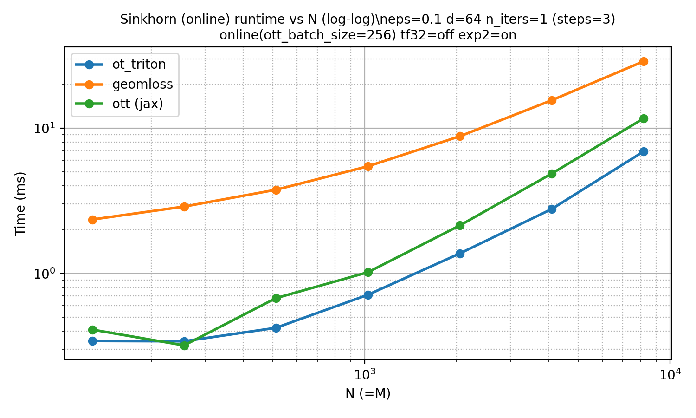
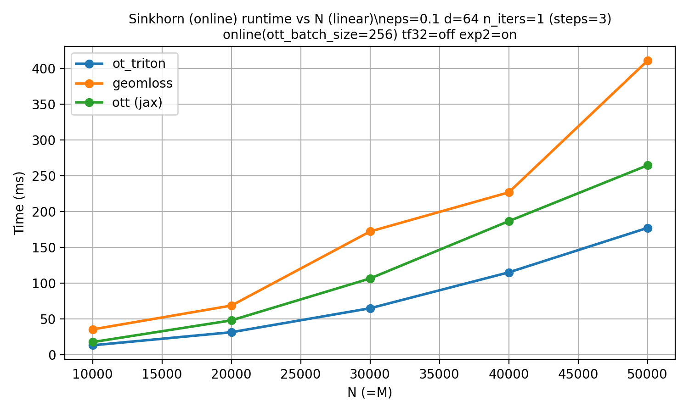

# OT Triton

OT Triton is a research-focused implementation of **entropic optimal transport (Sinkhorn)** in **PyTorch + Triton** for **squared Euclidean cost only**. The key contribution is a **fused, streaming Triton kernel** that computes **log-sum-exp (LSE) online**, **never materializing the `n x m` cost/kernel matrix**. The LSE reduction uses a **FlashAttention-like heuristic**: stream tiles, maintain a running max + sumexp, and optionally use `exp2/log2` for stability and speed.

## What this repo provides

- **GeomLoss-style online Sinkhorn** (symmetric updates, optional epsilon scaling), fully fused in Triton.
- **OTT-style alternating updates** for potentials (`f,g`) in log-domain.
- **SamplesLoss-like API** (`ot_triton.SamplesLoss`) for drop-in usage.
- **Analytic gradients** (no backprop through iterations).
- **Hessian-vector product (HVP)** w.r.t. `x` (streaming, no plan materialization). CG preconditioners: `none` (default), `jacobi`, `neumann-k`.
- **Multiscale (D=1/2/3) blocksparse** backends for approximate large-scale OT.

Constraints:
- Cost is **full squared Euclidean**: `||x-y||^2`.
- Online mode only (no dense `n x m` cost/plan allocation in kernels).

## Install

```bash
pip install -e .
pip install -e ".[dev]"
```

Environment snapshot (this repo):

- Conda env: `jax311`
- Python: 3.11.13
- CUDA toolkit: 12.1
- GPU: NVIDIA A100-SXM4-80GB
- torch: 2.5.1+cu121
- triton: 3.1.0

Only `torch` and `triton` are required for usage. Other packages are for benchmarks only.

## Quickstart

### Fused GeomLoss-style potentials (online, fixed eps)

```python
import torch
from ot_triton.kernels import sinkhorn_geomloss_online_potentials_sqeuclid

x = torch.randn(8192, 64, device="cuda", dtype=torch.float32)
y = torch.randn(8192, 64, device="cuda", dtype=torch.float32)
a = torch.rand(8192, device="cuda", dtype=torch.float32) + 0.1
b = torch.rand(8192, device="cuda", dtype=torch.float32) + 0.1
a = a / a.sum()
b = b / b.sum()

f, g = sinkhorn_geomloss_online_potentials_sqeuclid(
    x,
    y,
    a,
    b,
    use_epsilon_scaling=False,
    eps_list=[0.1] * 16,
    allow_tf32=False,   # strict FP32
    use_exp2=True,      # FlashAttention-like exp2/log2 path
)
```

### SamplesLoss-like API

```python
import torch
from ot_triton import SamplesLoss

loss = SamplesLoss("sinkhorn", blur=0.1, scaling=0.5, debias=False)
val = loss(torch.randn(4096, 64, device="cuda"),
           torch.randn(4096, 64, device="cuda"))
```

### Gradient (analytic, no backprop through iterations)

```python
import torch
from ot_triton import SamplesLoss

x = torch.randn(4096, 64, device="cuda", requires_grad=True)
y = torch.randn(4096, 64, device="cuda")

loss = SamplesLoss("sinkhorn", blur=0.1, scaling=0.5, debias=False)
val = loss(x, y)
grad_x = torch.autograd.grad(val, x)[0]  # analytic gradient kernel
```

### Hessian-Vector Product (HVP, analytic, no backprop through iterations)

```python
# Double backward gives HVP via CG solver (no plan materialization)
v = torch.randn_like(x)
grad_x = torch.autograd.grad(val, x, create_graph=True)[0]
hvp_x = torch.autograd.grad((grad_x * v).sum(), x)[0]  # analytic HVP kernel
```

For more details (preconditioners, multiscale HVP, manual API), see [GRADIENT_HVP.md](GRADIENT_HVP.md).

## FlashAttention-like LSE heuristic (core idea)

The fused kernels:

- stream tiles of `(x,y)` and **compute costs on the fly**,
- keep a **running max** and **sumexp accumulator** (online LSE),
- optionally compute in `exp2/log2` space for stability,
- never allocate a dense `n x m` cost matrix.

This is the main performance trick that makes large-scale OT feasible without full matrix materialization.

## Benchmarks (strict FP32)

OTT-style parity benchmark (Torch+Triton vs JAX+OTT):

```bash
python -m ot_triton.bench.bench_sinkhorn_ott_full \
  --n 8192 --m 8192 --d 64 --dtype float32 --eps 0.1 --n-iters 1 \
  --batch-size 256 --jax-matmul-precision highest --bench-order jax-first \
  --autotune
```

Online Sinkhorn (GeomLoss-style) vs GeomLoss vs OTT/JAX:

```bash
PYTHONPATH=src python -m ot_triton.bench.plots.plot_benchmarks_sinkhorn_vs_geomloss_ott_eps0p1_d64
```

Benchmark plots (generated by the script above):




## Tuning tips (rule-of-thumb)

- `axis=0` reductions are register-heavy -> keep `BLOCK_N<=64` in fp32.
- Strict fp32: `BLOCK_K=32` and `num_stages=3` often hide latency best.
- Use `--autotune` to select a config from a **small curated set** (no blind search).

## Layout

```
GRADIENT_HVP.md  # gradient + HVP usage
src/ot_triton/
  kernels/   # Triton kernels + wrappers
  testing/   # references and pytest suites
  bench/     # benchmarks + plots
```
