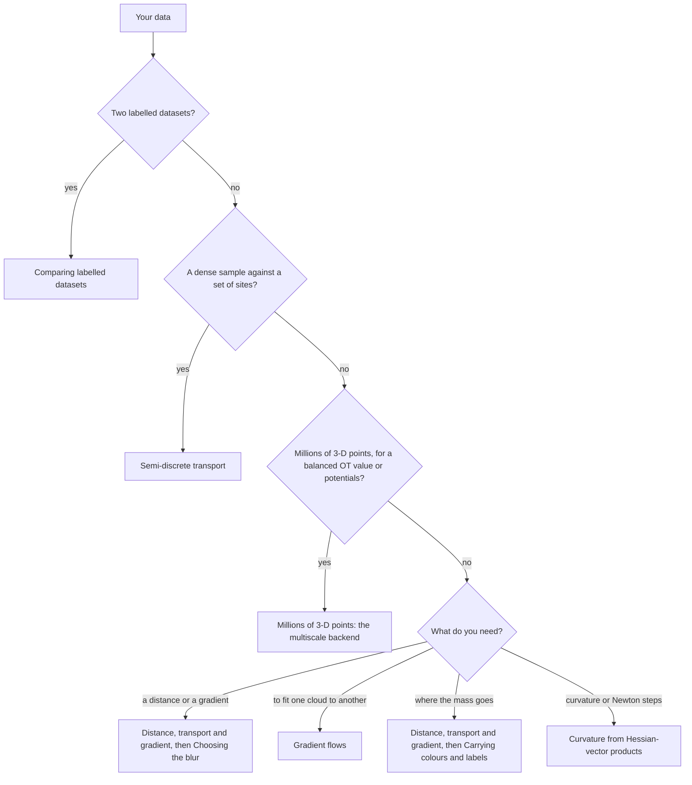

# Examples

Runnable scripts at the scale flash-sinkhorn is built for, from 10,000 points to millions, each on one GPU and
without ever forming the n x m cost matrix. Each script prints its timings, its peak GPU memory and the memory a
dense float32 matrix would need, and writes the figures shown below.


```bash
pip install -e ".[examples]"     # from a clone of this repository
python examples/getting_started/plot_sinkhorn_basics.py
```

Most examples take about a minute on an A100, the multiscale one a few minutes. Most pass `autotune=False`; the
batches example compares both settings, and the multiscale backend tunes its own kernels. A first call compiles the
kernels or loads them from Triton's cache on disk; the basics example says when tuning pays off. The notions themselves (plans,
potentials, the blur) are taught in the [GeomLoss](https://www.kernel-operations.io/geomloss/_auto_examples/index.html)
and [OTT-JAX](https://ott-jax.readthedocs.io/) tutorials; these examples show what is specific to flash-sinkhorn:
conventions, parameters, accuracy and scale.

## Which example?



Whatever the task, three questions come back: do the numbers match GeomLoss or OTT-JAX (Matching GeomLoss and
OTT-JAX), do outliers distort the result (Outliers and missing mass), and is it converged (Is it converged?). Many
problems of changing size and high-dimensional features each have their own example under Scale.

## Situations

Each `SamplesLoss` key call states `half_cost` and `debias`, whose defaults (`False`) differ from GeomLoss's;
`backend` appears where it is not the default `"symmetric"`.

### Getting started

| If you | Example | Key call | Figure |
|---|---|---|---|
| have two large point clouds and want their distance, gradient or plan | [Distance, transport and gradient between two large point clouds](getting_started/plot_sinkhorn_basics.py) | `SamplesLoss(blur=0.05, half_cost=True, debias=True)` |  |
| need to choose the blur | [Choosing the blur at scale](getting_started/plot_blur.py) | `SamplesLoss(blur=0.1, half_cost=True, debias=True)` |  |
| fit one cloud to another: registration, shapes, generative models | [Fitting one point cloud to another: gradient flows](getting_started/plot_gradient_flow_2d.py) | `torch.autograd.grad(SamplesLoss(blur=0.1, half_cost=True, debias=True)(x, y), x)` |  |

### Choosing parameters

| If you | Example | Key call | Figure |
|---|---|---|---|
| migrate from GeomLoss or OTT-JAX, or need their numbers | [Matching GeomLoss and OTT-JAX](choosing_parameters/plot_conventions.py) | `SamplesLoss(blur=0.05, half_cost=True, debias=True)  # geomloss.SamplesLoss("sinkhorn", p=2, blur=0.05)` |  |
| have outliers or missing parts on one side | [Outliers and missing mass: unbalanced and semi-unbalanced OT](choosing_parameters/plot_unbalanced.py) | `SamplesLoss(blur=0.05, half_cost=True, debias=False, reach_x=None, reach_y=1.0)` |  |
| need to know whether a result is converged, or want it faster or more accurate | [Is it converged? Accuracy, time and the stopping test](choosing_parameters/plot_convergence.py) | `SamplesLoss(blur=0.05, half_cost=True, debias=False, scaling=0.95, allow_tf32=False)` |  |

### Scale

| If you | Example | Key call | Figure |
|---|---|---|---|
| need a balanced OT value or potentials for millions of 3-D points | [Millions of 3-D points: the multiscale backend](scale/plot_multiscale_3d.py) | `SamplesLoss(blur=0.05, half_cost=True, debias=False, backend="multiscale")` |  |
| solve many problems, of changing sizes, in a loop | [Many problems: batches and changing sizes](scale/plot_many_problems.py) | `SamplesLoss(blur=0.05, half_cost=True, debias=True)(x, y)  # x: (B, N, D)` |  |
| have features in hundreds of dimensions | [High-dimensional embeddings](scale/plot_embeddings.py) | `SamplesLoss(blur=10.0, half_cost=True, debias=False, allow_tf32=False)` |  |

### Advanced

| If you | Example | Key call | Figure |
|---|---|---|---|
| need curvature or Newton steps on a few parameters | [Curvature from Hessian-vector products](advanced/plot_hvp_newton.py) | `SamplesLoss(blur=0.05, half_cost=True, debias=False, scaling=0.95, allow_tf32=False)` |  |
| have a dense sample and a set of sites: quantization, Laguerre cells | [Semi-discrete transport: the c-transform](advanced/plot_semi_dual.py) | `c_transform_cost(x, y, psi, cost_scale=0.5, allow_tf32=False, a=a, b=b)` |  |
| compare labelled datasets (OTDD) | [Comparing labelled datasets: the label-augmented cost](advanced/plot_label_cost.py) | `SamplesLoss(blur=0.1, half_cost=True, debias=True, label_cost_matrix=W, lambda_y=1.0)` |  |
| carry colours or labels from one cloud to another | [Carrying colours and labels: barycentric projection](advanced/plot_attribute_transfer.py) | `SamplesLoss(blur=0.05, half_cost=True, debias=False, potentials=True, scaling=0.95, allow_tf32=False)` |  |

Plans, marginals and barycentric projections are applied by streaming kernels through the small helper
[`_transport.py`](_transport.py), which converts the potentials `SamplesLoss(potentials=True)` returns to the
kernels' convention.
