# Tutorials and examples

Learn how to turn two point clouds into a loss, interpret transport and gradients, and check a result before
using it. The tutorials explain these ideas with code and figures together. The case gallery then applies
them to clouds from 10,000 points to millions, on one GPU, using streaming computation.

## Start here

1. [From two point clouds to a differentiable loss](getting_started/first_steps.ipynb): follow one translated cloud
   through costs, plans, potentials, debiasing, gradients, optimization and a mass-conservation check.
2. [Choose parameters and check the result](choosing_parameters/guide.ipynb): connect blur, coordinate units,
   marginal relaxation, convergence and precision to the quantity your application needs.
3. [Distance, transport and gradient at scale](getting_started/plot_sinkhorn_basics.ipynb) · [Python](getting_started/plot_sinkhorn_basics.py): extend the same
   concepts to a blob and an arc, applying the plan without constructing its full matrix.
4. Pick an application below: fit a shape, carry an attribute, compare labelled data, or solve at a larger scale.

All fifteen notebooks can be read in the browser, including a reference figure for each example. The first
lesson and thirteen applications have executable code cells; the parameter guide is a reading notebook with
links to those applications. Each application also has a Python script for command-line use.

The displayed reference figures come from previous script runs. Notebook code outputs are initially empty;
**Run All** on a CUDA GPU prints fresh results, displays figures and animations, and rewrites the corresponding
images in the checkout. Start Jupyter from the repository root or a notebook's own folder, then select the
Python environment where you installed the package. The scale examples use the same full problem sizes as
the scripts.

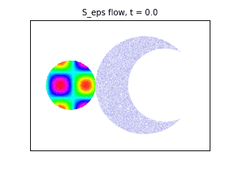

```bash
pip install --upgrade "flash-sinkhorn[notebooks]"
git clone https://github.com/ot-triton-lab/flash-sinkhorn.git
cd flash-sinkhorn
jupyter lab examples/getting_started/first_steps.ipynb
```

The checkout supplies the example files and plotting helpers. The solver comes from the installed package;
use `pip install --upgrade flash-sinkhorn` to update it.

Each example reports its runtime on your GPU. Most pass `autotune=False`; the
batches example compares both settings, and the multiscale backend tunes its own kernels. A first call compiles the
kernels or loads them from Triton's cache on disk; the basics example says when tuning pays off. The HVP path
has its own default tuning behavior. For further OT applications, see the
[GeomLoss gallery](https://www.kernel-operations.io/geomloss/_auto_examples/index.html) and
[OTT-JAX tutorials](https://ott-jax.readthedocs.io/tutorials/index.html).

## Situations

Each `SamplesLoss` key call states `half_cost` and `debias`, whose defaults (`False`) differ from GeomLoss's;
`backend` appears where it is not the default `"symmetric"`.

### Getting started

| If you | Example | Key call | Figure |
|---|---|---|---|
| have two large point clouds and want their distance, gradient or plan | [Distance, transport and gradient between two large point clouds](getting_started/plot_sinkhorn_basics.ipynb) · [Python](getting_started/plot_sinkhorn_basics.py) | `SamplesLoss(blur=0.05, half_cost=True, debias=True)` | 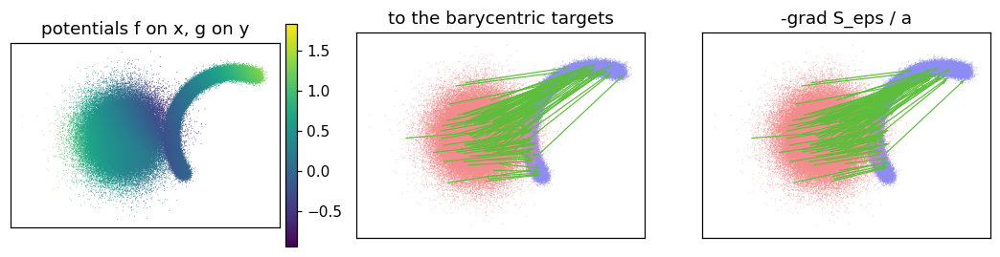 |
| need to choose the blur | [Choosing the blur at scale](getting_started/plot_blur.ipynb) · [Python](getting_started/plot_blur.py) | `SamplesLoss(blur=0.1, half_cost=True, debias=True)` | 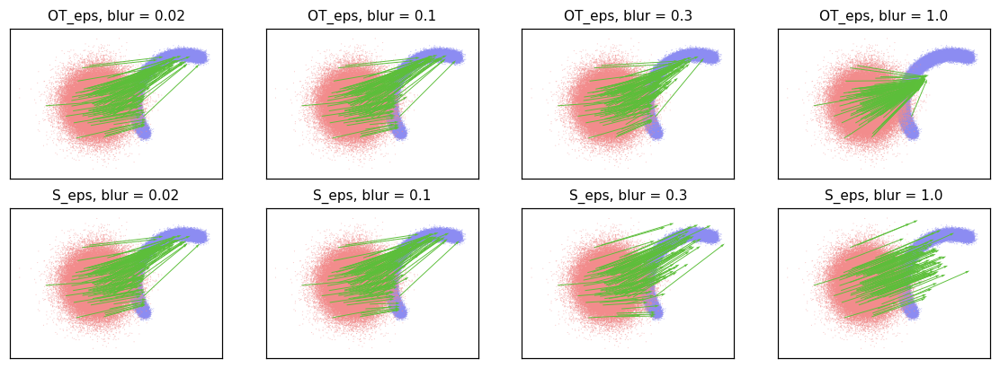 |
| fit one cloud to another: registration, shapes, generative models | [Fitting one point cloud to another: gradient flows](getting_started/plot_gradient_flow_2d.ipynb) · [Python](getting_started/plot_gradient_flow_2d.py) | `torch.autograd.grad(SamplesLoss(blur=0.1, half_cost=True, debias=True)(x, y), x)` | 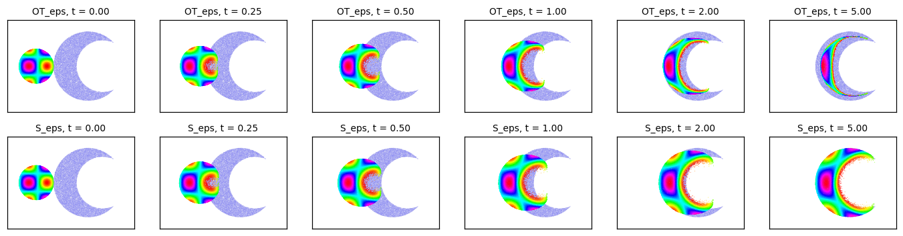 |

### Choosing parameters

| If you | Example | Key call | Figure |
|---|---|---|---|
| migrate from GeomLoss or OTT-JAX, or need their numbers | [Matching GeomLoss and OTT-JAX](choosing_parameters/plot_conventions.ipynb) · [Python](choosing_parameters/plot_conventions.py) | `SamplesLoss(blur=0.05, half_cost=True, debias=True)  # geomloss.SamplesLoss("sinkhorn", p=2, blur=0.05)` | 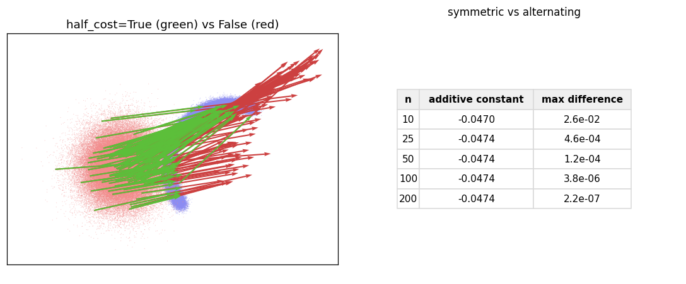 |
| have outliers or missing parts on one side | [Outliers and missing mass: unbalanced and semi-unbalanced OT](choosing_parameters/plot_unbalanced.ipynb) · [Python](choosing_parameters/plot_unbalanced.py) | `SamplesLoss(blur=0.05, half_cost=True, debias=False, reach_x=None, reach_y=1.0)` | 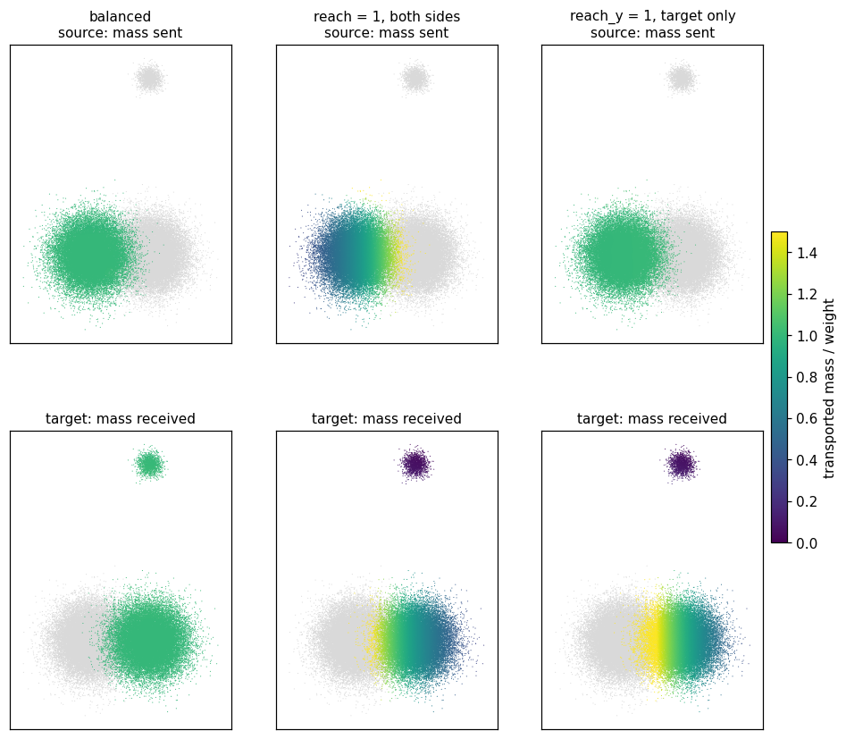 |
| need to know whether a result is converged, or want it faster or more accurate | [Is it converged? Accuracy, time and the stopping test](choosing_parameters/plot_convergence.ipynb) · [Python](choosing_parameters/plot_convergence.py) | `SamplesLoss(blur=0.05, half_cost=True, debias=False, scaling=0.95, allow_tf32=False)` | 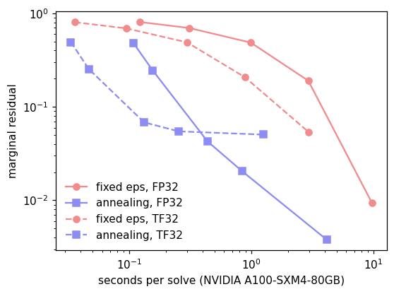 |

### Scale

| If you | Example | Key call | Figure |
|---|---|---|---|
| need a balanced OT value or potentials for millions of 3-D points | [Millions of 3-D points: the multiscale backend](scale/plot_multiscale_3d.ipynb) · [Python](scale/plot_multiscale_3d.py) | `SamplesLoss(blur=0.05, half_cost=True, debias=False, backend="multiscale")` | 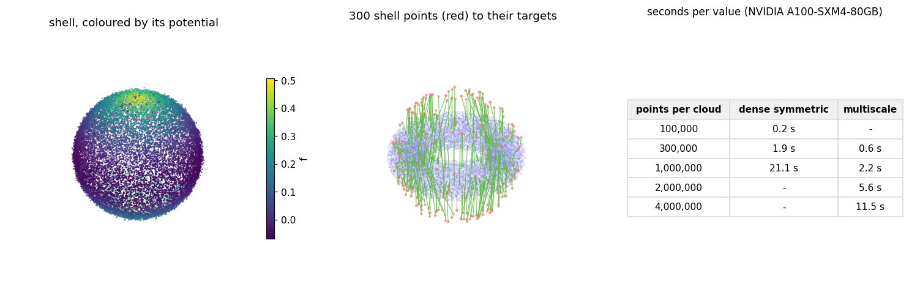 |
| solve many problems, of changing sizes, in a loop | [Many problems: batches and changing sizes](scale/plot_many_problems.ipynb) · [Python](scale/plot_many_problems.py) | `SamplesLoss(blur=0.05, half_cost=True, debias=True)(x, y)  # x: (B, N, D)` | 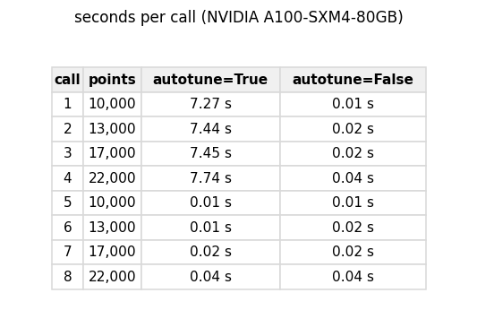 |
| have features in hundreds of dimensions | [High-dimensional embeddings](scale/plot_embeddings.ipynb) · [Python](scale/plot_embeddings.py) | `SamplesLoss(blur=10.0, half_cost=True, debias=False, allow_tf32=False)` | 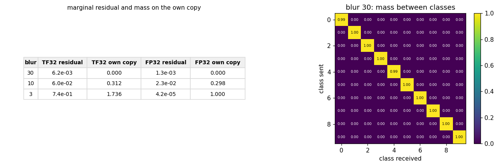 |

### Advanced

| If you | Example | Key call | Figure |
|---|---|---|---|
| need curvature or Newton steps on a few parameters | [Curvature from Hessian-vector products](advanced/plot_hvp_newton.ipynb) · [Python](advanced/plot_hvp_newton.py) | `SamplesLoss(blur=0.05, half_cost=True, debias=False, scaling=0.95, allow_tf32=False)` | 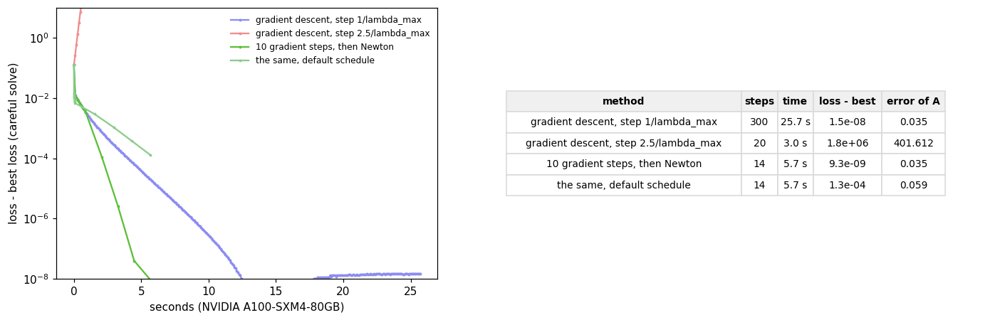 |
| have a dense sample and a set of sites: quantization, Laguerre cells | [Semi-discrete transport: the c-transform](advanced/plot_semi_dual.ipynb) · [Python](advanced/plot_semi_dual.py) | `c_transform_cost(x, y, psi, cost_scale=0.5, allow_tf32=False, a=a, b=b)` | 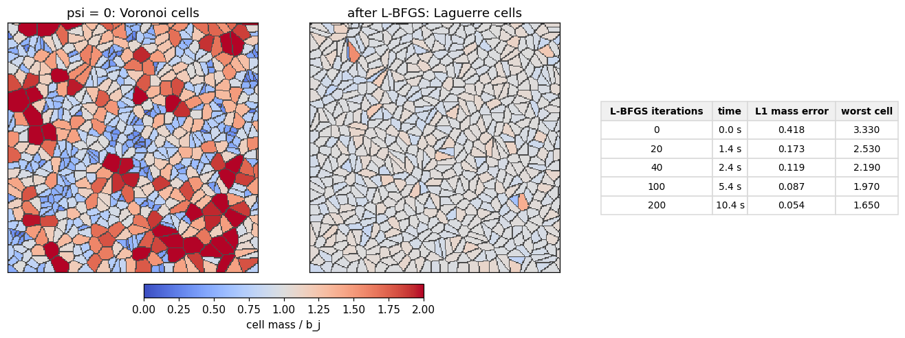 |
| compare labelled datasets (OTDD) | [Comparing labelled datasets: the label-augmented cost](advanced/plot_label_cost.ipynb) · [Python](advanced/plot_label_cost.py) | `SamplesLoss(blur=0.1, half_cost=True, debias=True, label_cost_matrix=W, lambda_y=1.0)` | 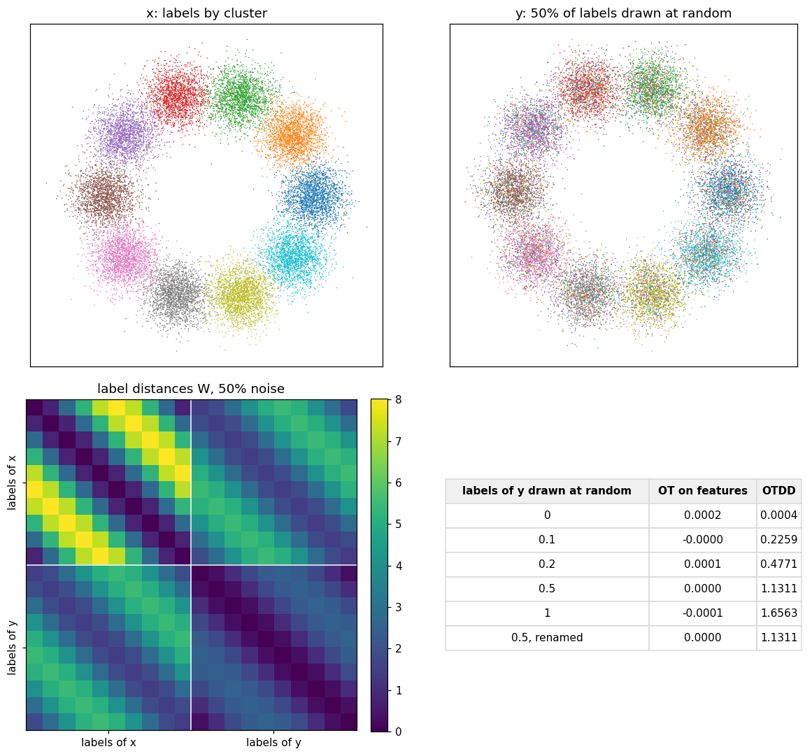 |
| carry colours or labels from one cloud to another | [Carrying colours and labels: barycentric projection](advanced/plot_attribute_transfer.ipynb) · [Python](advanced/plot_attribute_transfer.py) | `SamplesLoss(blur=0.05, half_cost=True, debias=False, potentials=True, scaling=0.95, allow_tf32=False)` | 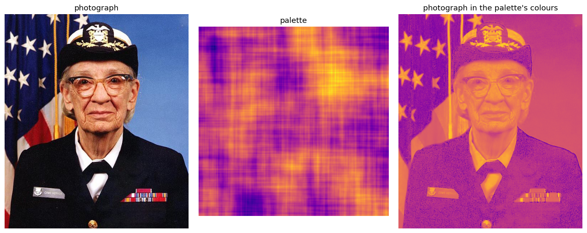 |

Plans, marginals and barycentric projections are applied by streaming kernels through the small helper
[`_transport.py`](_transport.py), which converts the potentials `SamplesLoss(potentials=True)` returns to the
kernels' convention.

## Running scripts and maintaining notebooks

For command-line execution without Jupyter, install `pip install --upgrade "flash-sinkhorn[examples]"` and run, for example,
`python examples/getting_started/plot_sinkhorn_basics.py`. Both forms use the same numerical code.

The `.py` scripts and the Markdown lessons
([first steps](getting_started/first_steps.md), [parameter guide](choosing_parameters/guide.md)) are the sources.
Edit those files to contribute changes, then regenerate their adjacent notebooks:

```bash
python examples/_notebooks.py
python examples/_notebooks.py --check
python -m pytest -q -p no:cacheprovider tests/test_notebooks.py
```

The generator uses only the Python standard library. The notebook tests need the `notebooks` extra and
`pytest`; they check source preservation, navigation, fresh PNG/GIF display and real Jupyter kernel startup
on CPU. The numerical examples themselves require CUDA. Regeneration replaces local notebook edits and
execution outputs, while keeping the reference figures as labelled Markdown attachments.
